# Turnierplanung mit Ipponboard

## Die verschiedenen Phasen eines Turnieres

* **Vorarbeit**: Die Meta-Informationen werden zusammengetragen um ein Turnier auszuschreiben
* **Planung**: Andere Vereine melden ihre Teilnehmer an den Veranstalter. Diese plant die nötige Mattenbelegung und Ausstattung am Turniertag und informiert bei Überbelegung.
* **Warmup**: Die TeilnehmerInnen besuchen den Austragungsort und validieren durch Wiegen ihre Gewichtsklasse. Nach dem Ende der Wiegezeit hat der Veranstalter alle nötigen Informationen um Wettkampflisten zu erstellen, zu publizieren und mit diesen das Turnier zu beginnen.
* **Austragung**: Die Ipponboard Instanzen an den Wettkampf-Flächen können die Wettkampflisten ab arbeiten. Ergebnisse sollten synchronisiert werden. TeilnehmerInnen bzw. deren Begleitungen können die Abläufe und Ergebnisse verfolgen.
* **Siegerehrung**: Nach Abarbeitung aller Wettkampflisten können die erfolgreichen TeilnehmerInnen geehrt werden.
* **Dokumentation**: Ergenisse können aggregiert werden zur Dokumentation und Meldung an offizielle Organe und beteiligte Verein.

## Akteure

* **Veranstalter**: Dieser pflegt die Metadaten für ein Turnier ein. Übernimmt die Daten auf den Startkarten. Erstellt die Kampflisten. Wertet Kampflisten aus zur Urkundenerstellung. Startet und Beendet Turnier.
* **Trainer von Teilnehmern**: Die Meldung von Teilnehmern wird für gewöhnlich vom Trainer übernommen. Dieser erhält auch die Startkarten
* **Teilnehmer**: Dieser erscheint pünktlich. Meldet sich zum wiegen. Tritt auf jener Matte an, wo seinen Kampfliste abgearbeitet wird. Erscheint zu seinen Kämpfen. Erscheint zur Siegerehrung zur Entgegennahme seiner Urkunde.
* **Mattenrichter**: Gibt die Komandos, welche von den Bedienern Ipponboards am Richtertisch dokumentiert und visualisiert werden.
* **Ipponboard-Bediener am Richtertisch**: Startet Kampfliste, bedient Ipponboard nach Schiedsrichteranweisungen, beendet Kampfliste.

## Artefakte
* **Startkarte**: Wird ausgehändigt an Teilnehmer/Trainer und ausgefüllt von Waagenbedienern. Ergebnis wird übernommen vom Veranstalter. Kann auf standardisiertem Vordruck erfolgen, könnte automatisch eingelesen werden. Könnte über digitalen Ausdruck erfolgen (alle Metadaten im QR-code und zur Sicherheit als Text) und das Gewicht könnte in Textfeldern angekreuzt werden bzw. eine Gewichtsklasse könnte angekreuzt werden.
Könnte auch voll automatisiert erfolgen nach Identifizierung des gemeldeten Teilnehmerns an der Waage.  
* **Kampfliste**: Könnte ausgedruckt werden wie bisher -> manuelles ausfüllen und manuelles abtippen. Könnte als Datei über Netzwerk/Internet synchronisiert werden. Könnte über eine Datenbank synchronisiert werden. Könnte per http Server Client bzw. Ipponboard-Instanzen-Netzwerk synchronisiert werden. Könnte über zentralen Public Server synchronisiert werden.
* **Urkunden**: Könnte manuell erstell werden wie bisher. Könnte automatisch auf Basis der fertigen Wettkampflisten erstellt werden und gedruckt werden. 

## Architektur-Modell
In der Datei 'architecture-model.c4' ist ein Architektur-Moell enhalten, welches mit Hilfe der C4-Beschreibungssprache erstellt wurde. Diese Datei kann mit der "LikeC4"-Extension für Visual Studio Code angesehen und bearbeitet werden. Gleiches ist über folgende URL möglich: [https://likec4.dev/playground/](https://likec4.dev/playground/).

## Modell zur Datenhaltung über den Turnierablauf durch Ipponboard

```mermaid
---
title: Ipponboard Wettkampf manager
---

classDiagram
    Turnier *-- Wettkampf
    Wettkampf --> TeilnehmerBase
    Wettkampf o-- KampfListe
    Gewichtsklasse --o Wettkampf

    class Turnier  {
        +string Name
        +DateTime Meldeschluss
        +string Url
        +string KontaktEmail
        +Wettkampf[] Wettkaempfe
    }
    note for Turnier "Jedes Turnier kann aus mehreren Wettkämpfen bestehen\n also zB. U11m sowie U11w.\n Weil deren TeilnehmerInnen sich nicht mischen."

    class Wettkampf {
        +TeilnehmerBase[] GemeldeteTeilnehmer
        +KampfListe[] Listen
        +string Name
        +DateTime Datum
        +string Altersklasse
        +string Geschlecht
        +byte TurnierArt: Einzel, Mannschaft, Bundesliga, Bodenkampfturnier
        +DateTime WiegeStart
        +DateTime WiegeEnde
        +DateTime KämpfeStartGeplant
        +Gewichtsklasse[] Gewichtsklassen
    }
    class Mannschaft{
        +Teilnehmer[] Teilnehmer
    }

    class GewichtsklassenEinstellungen{
        +string Name
        +byte Kampfdauer
        +string SonstigesJSON
    }

    class Gewichtsklasse{
        +string name
        +int MaxGewicht
        +int MinGewicht
        +GewichtsklassenEinstellungen: Einstellungen
        +Teilnehmer[] GemeldeteTeilnehmer : Es erscheinen nicht unbedingt alle
    }
    Gewichtsklasse --|> GewichtsklassenEinstellungen

    class Teilnehmer{
        +Gewicht Gewicht
        +Gewichtsklasse GewichtsklasseAngedachte
        +Gewichtsklasse GewichtsklasseEcht
    }
    class TeilnehmerBase {
        <<Abstract>>
        +Key Id
        +string Name
        +Verein Verein
        +int TeilnehmerTyp : Mannschaft oder Einzelperson
        +int TeilnehmerListenNummer
    }
    Teilnehmer --|> TeilnehmerBase
    Mannschaft --|> TeilnehmerBase

    class Listensystem { 
        +string Name
    }
    class KampfListe {
        +string Name
        +ListenSystem System
        +Gewichtsklasse Gewichtsklasse
        +TeilnehmerBase[] Teilnehmer
        +Begegnungen[] Begegnungen
    }
    KampfListe *-- Begegnung
    KampfListe --> TeilnehmerBase
    KampfListe --> Gewichtsklasse
    KampfListe --> Listensystem

    class Punkte {
        +byte Ippon
        +byte WazaAri
        +byte Shido
        +byte Hansokumake
        +byte SummePunkte
        +bool SchiedsrichterEnt        
    }

    class SchiedsrichterZeichen {
        +DateTime Timestamp
        +DateTime RelativTimestamp
        +string Name
    }
    class Wertungsvergabe{
        +Punkte Wertung
    }
    note for Wertungsvergabe "Für Schiedsrichterzeichen,\n welche eine Wertung als Resultat haben.\n Diese können dann summiert übertragen werden."

    Wertungsvergabe --|> SchiedsrichterZeichen
    
    class KampfHistorie {
        +DateTime StartZeitpunkt
        +DateTime Endzeitpunkt
        +TimeSpan Dauer
        +Wertungsvergabe[] Wertungsvergaben
    }
    note for KampfHistorie "Der Weg ist das Ziel.\n Alles was während einer Begegnung von zwei Judokas passiert\n sollte geloggt werden. Damit auch für die Tischbesetzung klar ist\n wer, wann, wie oft auf was geklickt hat.\n Jeder Osaikomi, jedes Matte, jede zurückgenommene Wertung.\n So sicher wie Buchhaltung"

    class Begegnung {
        +int Nummer
        +byte Status : offen, sieg weiß sie rot, unentschieden
        +Punkte PunkteRot
        +Punkte PunkteWeiss
        +byte BegegnungStatus : ofen, läuft, vorbei
    }
    Begegnung <|-- BegegnungMannschaft
    Begegnung <|-- BegegnungEinzel

    note for Begegnung "Die Erstellung von Kampflisten führt dazu,\n dass jede denkbare Begegnung direkt erstellt\n und nummeriert wird.\n Begegnungen mit nur einem Teilnehmer sind Freilose."

    class BegegnungMannschaft {
        +Mannschaft Sieger
        +Mannschaft TeilnehmerWeiss
        +Mannschaft TeilnehmerRot
        +BegegnungEinzel[] Begegnungen
    }
    class BegegnungEinzel {
        +Teilnehmer TeilnehmerWeiss
        +Teilnehmer TeilnehmerRot
        +Teilnehmer Sieger
        +SchiedsrichterZeichen Ablauf
        +KampfHistorie Historie
    }
    Begegnung *-- Punkte
    KampfHistorie *-- SchiedsrichterZeichen
    BegegnungEinzel "1" *-- "1" KampfHistorie : hat eine ggf. volatile

```

