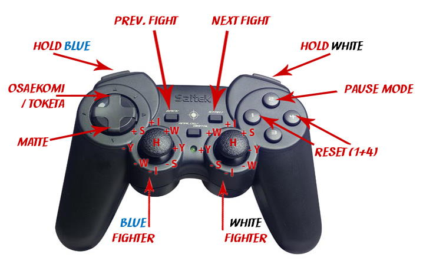

<p style="font-size:3em;text-align:center">Ipponboard</p>
<p style="font-style:italic;text-align:center">The 🥋Judo Score Board</p>

## Content

- **[General](#general)**
  - [License terms](#license-terms)
  - [Acknowledgements](#acknowledgements)
  - [System requirements](#system-requirements)
  - [Version history](#version-history)
  - [Feedback & contact](#feedback--contact)
- **[Operation & Settings](#operation--settings)**
  - [Displays](#displays)
    - [Primary display](#primary-display)
    - [Secondary/external display](#secondaryexternal-display)
  - [Program settings](#program-settings)
- **[Controlling Iponboard](#controlling-ipponboard)**
  - [Gampad rocks!](#gampad-rocks)
  - [Working with mouse, keyboard or gamepad](#working-with-mouse-keyboard-or-gamepad)
  - [Awarding and undoing points](#awarding-and-undoing-points)
  - [Reset display](#reset-display)
  - [Start/stop main timer (*Hajime/Matte*)](#startstop-main-timer-hajimematte)
  - [Start/stop hold timer (*Osaekomi/Toketa*)](#startstop-hold-timer-osaekomitoketa)
  - [Reset hold timer](#reset-hold-timer)
  - [Sono-mama/Yoshi](#sono-mamayoshi)
- **[Troubleshooting](#troubleshooting)**
  - [Preparing for dual screen operation](#preparing-for-dual-screen-operation)
  - [Command line parameters](#command-line-parameters)

# General

## License terms
  
Ipponboard was written and developed by Florian Mücke.

_Copyright © 2009-today Florian Mücke and [individual contibutors](https://github.com/fmuecke/Ipponboard/blob/main/CONTRIBUTORS.md)._

### Ipponboard binaries

- *Ipponboard may be used freely on any number of computers and the program may be passed on to third parties in unchanged form free of charge.*
- The binaries of the Ipponboard project are released under the following license: [Attribution-NoDerivs 3.0 Unported](http://creativecommons.org/licenses/by-nd/3.0/)

### Ipponboard source code

- The Ipponboard source code was released under a BSD-like license in 2020.
- Check the [LICENSE file](https://github.com/fmuecke/Ipponboard/blob/master/LICENSE.txt) in https://github.com/fmuecke/Ipponboard repository.

### Third-party components


Ipponboard uses the following third-party components, which are licensed under the specified types. All license files are also stored in the `licenses` folder of the Ipponboard installation path.

- **[Qt Framework](http://www.qtproject.org)**
  - Licensed under [LGPLv3 with Exception](licenses/Qt5/LICENSE.GPL3-EXCEPT).
  - Source code can be obtained from [https://download.qt.io/archive/qt/5.15](https://download.qt.io/archive/qt/5.15/).
  - No modifications were made to the Qt source code.
  - This application dynamically links to the Qt libraries. You have the freedom to replace the Qt libraries used by this application with your own modified versions.
  - For more details, refer to the [LGPL v3](licenses/Qt5/LICENSE) license text included in the `licenses` folder or available online at [https://www.gnu.org/licenses/lgpl-3.0.html](https://www.gnu.org/licenses/lgpl-3.0.html).

- **[Boost C++ libraries](http://www.boost.org)**
  - Licensed under [Boost Software License](licenses/boost/LICENSE_1_0.txt).

- **Microsoft Visual C++ CRT**
  - Licensed under [Visual Studio 2013 Redistributables License](licenses/MSVC/redist.txt).

- **[JsonCpp](https://github.com/open-source-parsers/jsoncpp)** by Baptiste Lepilleur
  - Licensed under [MIT License](licenses/jsoncpp/LICENSE).

- **Sound files**
  - Created for Ipponboard from different samples; see [Attribution.txt](sounds/attribution.txt)

- **[FamFam Flag icons](http://www.famfamfam.com/archive/flag-icons-released/)** by Mark James
  - Licensed as [public domain](licenses/flags/readme.txt)

- **[Fugue Icons](http://p.yusukekamiyamane.com/)** by Yusuke Kamiyamane
  - Licensed under [CC BY 3.0](http://creativecommons.org/licenses/by/3.0/)
  - most files [copyrighted by Yusuke Kamiyamane](licenses/Fugue-iconset/copyright_fugue.txt)
  - some other files have [different copyright owner](licenses/Fugue-iconset/README.txt)

<!--- Tinytoml, [tinytoml](https://github.com/mayah/tinytoml), [BSD 2-clause](licenses/tinytoml/LICENSE)-->

## Acknowledgements

My special thanks go to the following people who contributed significantly to its creation:

- Heini Schäfer - for the idea, the incentive, the criticism and the know-how
- My wife Anja for her patience
- Christophe Henry - for 'boost::msm
- as well as the following clubs for trust and feedback: 
  *TSV Königsbrunn, Post SV Telekom Augsburg, TSV Peiting, TSV München-Grosshadern, 
 DJK Ingolstadt, PSV München, TSV Mainburg*, and many more.

## System requirements

To use the competition display the following hardware and software requirements apply:

- Computer with at least Windows 7 with external monitor connection (preferably
 a laptop)
- TV or large computer screen for secondary display
- connection cable computer &rarr; secondary screen
- Optional:
  - USB gamepad to control the display (e.g.Saitek P380)
  - loudspeaker for the mat signal (but can also be played via audio cable via the TV)

## Version history

- The latest version of this manual can be found on the [GitHub](https://github.com/fmuecke/Ipponboard/blob/main/doc/USER_MANUAL_EN.md). 
- Information about the changes (changes, bugfixes) of the latest versions can be found on the following page: [Changes](CHANGELOG.html)

## Feedback & contact

> *Your opinion counts!*

I think that the display system is pretty great,
it's certainly not flawless, and in one or two places it's still
or other corner it is not perfect yet. *Please help us to improve it!

- Bring your ideas and suggestions
- Try it out in your club
- Tell your friends
- Inform us about bugs and problems with the service

Questions or suggestions for improvement may be directed to:

- Homepage: <https://ipponboard.koe-judo.de> 
- Issues and bug tracker: [https://github.com/fmuecke/Ipponboard/issues](https://github.com/fmuecke/Ipponboard/issues)  
- E-Mail: [ipponboardinfo ât gmail.com](mailto:ipponboardinfo@gmail.com)  

# Operation & Settings

Ipponboard is an advanced display system for managing fight time time and points, designed specifically for judo competition. During the development, special attention has been and will be paid to:
  
- Excellent readability
- Easy handling
- Uncomplicated use

The program is basically operated from a PC (laptop) and controlled with mouse or gamepad. Ipponboard manages two displays, an external one for the the fighters/supervisors/audience and one for the timekeepers. The display of the timekeeper is mirrored, so that it can be better assigned to the fighters.

## Displays

Ipponboard uses two customized displays to provide the best possible comfort for the operators on one side and the fighters/referees and spectators on the other.

Each display consists mainly of five areas:

- Fight time: this is located at the bottom of the display. If the fight is interrupted the fight time is displayed in red, otherwise in yellow.
- Scores: The scores are grouped on the side of the respective fighter and in the respective color combination (white on blue or black on white).
- Penalties are symbolized by red dots
- Holding time 
- Fight information (mat number, current weight class)
- Names of the fighters

### Primary display

The primary display serves as the central control unit for the Ipponboard operator. On it all information is available and adjustable:

- Start/stop/(reset) fight and hold time
- Reset fight
- change names of fighters
- Set/reset scores
- change fight information (mat number, current weight class)


Whizzard of Oz.

### Secondary/external display

In contrast to the primary display, the secondary display shows only those details that are details that are essential for the fight:

- Only the scores up to Waza-ari (Ippon is superimposed flashing)
- Only the active penalties
- Only the active hold time

In addition, the secondary display does not respond to mouse input.

> Tip:* The secondary display can be (de)activated via the hotkey `F2`.

Whether the second display should be shown immediately at program start or on which screen or on which screen it should be displayed, can be defined in the program settings.

How to configure the computer for dual view operation can be found in the appendix [Preparing the computer for dual screen operation](#troubleshooting).


## Program settings

The program settings can be found in the application menu under *Settings*. They provide access to various general options for customizing the program:

- Configure secondary display
- Change colors and font for info area
- Change colors for fighters/ratings
- Select sound file for timekeeper table signal


Besides the general options, the gamepad buttons and keyboard accessors can also be reassigned in the settings menu.


# Controlling Iponboard

Ipponboard can be controlled with the following input devices:

- Mouse 🐭
- Keyboard ⌨️
- Gamepad 🎮

Even if the control by mouse is very intuitive and catchy, my experiences have shown that with the gamepad a substantially more relaxed operation is possible. Therefore I would like to recommend the control with the gamepad to you with the following reasons:

## Gampad rocks!

1. *Everything under control*

    With a standard USB gamepad, all essential functions can be accessed at the touch of a button - whether it's the hold display, fight time, scores or penalties. The left hand is responsible for the left fighter and the right hand for the right.

2. *Full concentration on the fight*.

   The eye does not have to constantly switch back and forth between the scoreboard and the mat. Scores can be entered directly and there is no need to constantly search for the mouse pointer and awkwardly move it to the score symbol. A press of a button and an occasional cursory check is all that is needed.

3. *Lean back and relax*.

   The best thing about it: you can lean back on your chair instead of sitting concentrated and tense in front of the mouse.

4. *Coolness factor*

   For youth use, don't underestimate the "coolness factor" - everyone really wants to operate like this!

## Working with mouse, keyboard or gamepad

- 🐭**Mouse**: The program can be controlled completely with the mouse. All that is required is to click on the respective fields in the primary (embedded) display or on the corresponding buttons in the user interface.

- ⌨️**Keyboard**: Almost everything in Ipponboard can be accessed by keyboard. The assignment of the individual buttons can be viewed in the [*Settings &rarr; Preferences*](#program-settings) menu.

- 🎮 **Gamepad**: Ipponboard was specially designed with gamepad use in mind. The button layout can be configured in the [*Settings &rarr; Preferences*](#program-settings) menu. The default configuration is as follows:
  
  

## Awarding and undoing points

Using the *mouse* 🐭:

- In order to assign points or take them back, you only have to click in the respective field. The following applies:

  Mouse Button | Action
  ----- | ------
  left | give score
  right | cancel score

Using the *gamepad* 🎮:

- Points are awarded using the two analog sticks. For the *blue* fighter, the following directions correspond to the respective points:

  
  
   Score | Button
  ---------------- | -----
   Ippon + | &uarr; up
   Ippon - | &darr; down
   Waza-ari + | &nearr; top right
   Waza-ari - | &swarr; down left
   Yuko + | &rarr; right
   Yuko - | &larr; left
   Shido + | &nwarr; left up
   Shido - | &searr; right bottom
   Hansokumake toggle | press stick

  For the *white* fighter the directions are simply mirrored.

- *Caution:* Please pay attention to how the respective axes of the gamepad are configured. You may have to invert them in the settings.
- *Tip:* To find out how the respective gamepad is aligned, you can use diagnostics mode in on the settings page. There you can see how the respective axes are aligned and how the buttons are numbered internally.

## Reset display

Using the *mouse*:

- Use the *Reset* button of the user interface.

Using the *gamepad* 🎮:

- To reset all values, the buttons defined for this purpose must be pressed simultaneously. Default is `button 1 + button 4`.

## Start/stop main timer (*Hajime/Matte*)

Using the *mouse* 🐭:

- The fight time can be started (yellow) and stopped (red) with a left click.

Using the *gamepad* 🎮:

- The main time is started or stopped using the `down` button of the gamepad's control pad.

## Start/stop hold timer (*Osaekomi/Toketa*)

Using the *mouse* 🐭:

- To start the hold time, click on the "00" field next to the hourglass. The hold will be displayed automatically for blue at first. Using the context menu of this field (right click), the hold can then be assigned to white, if necessary.
- Clicking the field again with the left mouse button stops the hold time.
- The time is now displayed until either a hold is triggered again, or the main time runs again after stopping (=*Hajime*).

Using the *gamepad* 🎮:

- The hold time is set by pressing the rear upper fire button (`button 7` and `button 8`). Thereby the left one is for the blue fighter and the right one for the white fighter. The button mapping can be changed via the settings.
- Pressing the hold key again will stop the hold (*Toketa*).
- If the button for the other fighter is pressed, it can be switched and the hold will then apply to that fighter.

## Reset hold timer

Using the *mouse* 🐭:

- Right click on the respective hold timer (you might want to stop the timer first)

Using the *gamepad* 🎮:

- This is done with the rear lower fire keys.

*Nice to know:* The first version could reset the time automatically on *Hajime* or resume on *Osaekomi*. Since this does not necessarily correspond to the usual behavior of a display, the behavior has been changed so that the hold time can and must be reset manually.

## *Sono-mama/Yoshi*

For *Sono-mama* you have to signal *Matte* during a hold. The hold time is then marked in gray (paused). By pressing the respective hold button, the hold can be resumed (*Yoshi*).


# Troubleshooting

## Preparing for dual screen operation

When configuring the second screen on the computer, the following points must be points must be strictly followed:

- *Expand desktop*

    So that the second screen can be used in the program, it must be it must be configured as an extended desktop. The resolution resolution is not important, it will be detected by the program and the content is scaled accordingly. If the display on the second monitor is not correct, it can also be set manually in the program settings manually. This requires a restart of the program.

- *Turn off interference*

   Please make sure that the computer does not automatically go to sleep (standby) automatically goes to sleep (standby) or the screen saver turns on. screen saver turns on. This can be avoided with newer newer computer models by switching them to presentation mode. presentation mode.

## Command line parameters

```
Usage: Ipponboard.exe [options]

Options:
  -?, -h, --help  Displays help on commandline options.
  --help-all      Displays help including Qt specific options.
  -v, --version   Displays version information.
  --mode <mode>   Selects starting mode: single|team|ask.
```


[Back to the top &uarr;](#content)
