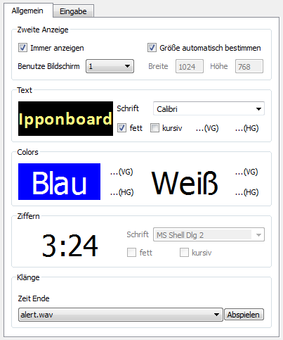

% *Ipponboard* Wettkampfanzeige
% **Version 1.6**

# Allgemeines zu *Ipponboard*

## Lizenzbedingungen
  
Ipponboard wurde geschrieben und entwickelt von Florian Mücke.

*Copyright © 2009-today Florian Mücke.*
   
**Ipponboard Binaries**

> **Ipponboard darf frei auf beliebig vielen Rechnern verwendet und das
> Programm in unveränderter Form unentgeltlich an Dritte weitergeben werden.** 

Die Binärdateien des Ipponboard-Projekts werden unter der folgenden Lizenz veröffentlicht:
[Attribution-NoDerivs 3.0 Unported](http://creativecommons.org/licenses/by-nd/3.0/)

**Ipponboard Quellcode**

- Die Lizenzbedingungen für den Quellcode findest du im [LICENSE file](https://github.com/fmuecke/Ipponboard/blob/master/LICENSE.md) im [Repository https://github.com/fmuecke/Ipponboard](https://github.com/fmuecke/Ipponboard) auf github.

**Drittanbieterkomponenten (3rd party components)**

Ipponboard verwendet folgende Drittanbieterkomponenten, die unter den angegebenen Arten lizensiert sind. Dies jeweiligen Lizenzdateien sind zudem im Ordner `Licenses` des Ipponboard-Installationspfades abgelegt.

- Qt Framework, [www.qtproject.org](http://www.qtproject.org), [LGPL](licenses/Qt4/LICENSE.LGPL), [LGPL Exception](licenses/Qt4/LGPL_EXCEPTION.txt), [Qt License Agreement](licenses/Qt4/.LICENSE-DESKTOP), [Qt v4.8.7 src](https://download.qt.io/archive/qt/4.8/4.8.7/qt-everywhere-opensource-src-4.8.7.zip), [Patch für MSVC 14+](licenses/Qt4/PATCH-qt4.8.7_with_msvc14x.diff), [Instructions - How to build](licenses/Qt4/HOW_TO_BUILD-qt4.8.7-msvc14x.txt)
- Boost C++ libraries, [www.boost.org](http://www.boost.org), [Boost Software License](licenses/boost/LICENSE_1_0.txt), 
- Microsoft Visual C++ CRT, [Visual Studio 2013 Redistributables License](licenses/MSVC/redist.txt)
- JsonCpp, [github.com](https://github.com/open-source-parsers/jsoncpp), [MIT License](licenses/jasoncpp/LICENSE)
- Sounddateien: Public Domain 2003
- FamFam Flag icons, [www.famfamfam.com](http://www.famfamfam.com/archive/flag-icons-released/), [by Mark James Public Domain](licenses/flags/readme.txt)
- Fugue Icons, [Yusuke Kamiyamane](http://p.yusukekamiyamane.com/), [Creative Commons Attribution 3.0 license](http://creativecommons.org/licenses/by/3.0/), [copyright.txt](licenses/Fugue-iconset/copyright_fugue.txt), [README.txt](licenses/Fugue-iconset/README.txt)
<!--- Tinytoml, [tinytoml](https://github.com/mayah/tinytoml), [BSD 2-clause](licenses/tinytoml/LICENSE)-->

## Danksagung

Mein besonderer Dank gilt folgenden Leuten, die maßgeblich zur Entstehung beigetragen haben:

- Heini Schäfer – für die Idee, den Ansporn, die Kritik und das Know-How
- Meiner Frau Anja für ihre Geduld
- Christophe Henry – für `boost::msm`
- sowie folgenden Vereinen für Vertrauen und Feedback: 
 *TSV Königsbrunn, Post SV Telekom Augsburg, TSV Peiting, TSV München-Grosshadern, 
 DJK Ingolstadt, PSV München, TSV Mainburg*, uvm.

## Systemvoraussetzungen

Um die Wettkampfanzeige nutzen zu können gelten folgende Hard- und Softwareanforderungen:

- Computer mit mind. Windows 7 mit externem Monitoranschluss (vorzugsweise
 ein Laptop)
- Fernseher oder großen Computerbildschirm für die sekundäre Anzeige
- Verbindungskabel Computer &rarr; Zweitbildschirm
- optional: 
	- USB-Gamepad zur Steuerung der Anzeige (z.B.Saitek P380)
	- Lautsprecher für das Mattensignal (kann aber auch per Audiokabel 
		über den Fernseher wiedergegeben werden)

## Änderungshistorie
Informationen über die Inhalte (Änderungen, Bugfixes) der letzten Versionen finden sich auf folgender Seite: [Changes](Changes.html)

## Feedback
> *Eure Meinung zählt!*

Ich finde zwar, dass das Anzeigesystem schon ziemlich toll ist,
trotzdem ist es sicher nicht fehlerlos und an der einen oder anderen
Ecke bestimmt noch nicht perfekt. *Bitte helft mit es zu verbessern!*

- Bringt eure Ideen und Vorschläge ein
- Probiert es in eurem Verein aus
- Sagt euren Freunden Bescheid
- Informiert uns über Fehler und Probleme mit der Bedienung

## Kontakt

Fragen oder Verbesserungsvorschläge können an die folgenden Stellen gerichtet werden:

- Homepage: <https://ipponboard.koe-judo.de> 
- Probleme und Bugtracker: [https://github.com/fmuecke/Ipponboard/issues](https://github.com/fmuecke/Ipponboard/issues)  
- E-Mail: [ipponboardinfo ât gmail.com](mailto:ipponboardinfo@gmail.com)  

# Funktionsweise & Einstellungen

Ipponboard ist ein fortschrittliches Anzeigesystem für die Verwaltung von Kampfzeit und  -punkten, das speziell für den Judowettkampf entwickelt wurde. Bei der Entwicklung wurde und wird auf die folgenden Punkte besonderes Augenmerk gelegt:
  
- ausgezeichnete Lesbarkeit
- einfache Bedienung
- unkomplizierter Einsatz
 
Das Programm wird prinzipiell von einem PC (Laptop) aus bedient und mit Maus oder Gamepad gesteuert. Ipponboard verwaltet zwei Anzeigen, eine externe für die Kämpfer/Betreuer/Publikum und eine für die Zeitnehmer. Die Anzeige der Zeitnehmer ist dabei gespiegelt, damit sie besser zu den Kämpfern zugeordnet werden kann.

## Anzeigen

Ipponboard verwendet zwei angepasste Anzeigen um den Bedienern auf der einen und den Kämpfern/Kampfrichtern und Zuschauern auf der anderen Seite den bestmöglichen Komfort zu bieten.

Jede Anzeige besteht im Wesentlichen aus fünf Bereichen: 

- Kampfzeit: Diese befindet sich am unteren Rand der Anzeige. Ist der Kampf unterbrochen wird die Kampfzeit rot dargestellt, ansonsten gelb.
- Wertungen: Die Wertungen sind auf der Seite des jeweiligen Kämpfers gruppiert und in der jeweiligen Farbkombination gehalten (Weiß auf Blau bzw. Schwarz auf Weiß). 
- Strafen sind durch rote Punkte symbolisiert.
- Haltegriffzeit 
- Kampfinformationen (Mattennummer, aktuelle Gewichtsklasse)
- Namen der Kämpfer

### Primäre Anzeige

Die primäre Anzeige dient als zentrale Steuereinheit für den 
Ipponboard-Bediener. Auf ihr sind alle Informationen verfügbar und 
einstellbar:

- Kampf- und Haltegriffzeit starten/stoppen/(zurück-)setzen
- Kampf zurücksetzen
- Namen der Kämpfer ändern
- Wertungen setzen/zurücknehmen
- Kampfinformationen (Mattennummer, aktuelle Gewichtsklasse) ändern

### Sekundäre (externe) Anzeige

Im Unterschied zur primären Anzeige werden auf der sekundären nur die für 
das Kampfgeschehen wesentlichen Details angezeigt:

- nur die Wertungen bis Waza-ari (Ippon wird blinkend darübergelegt)
- nur die aktiven Strafen
- nur die aktive Haltegriffzeit

Zudem reagiert die sekundäre Anzeige nicht auf Eingaben mit der Maus.

> *Tipp:* (De-)Aktivieren lässt sich die sekundäre Anzeige über den Hotkey 
`F2`.

Ob die zweite Anzeige beim Programmstart gleich angezeigt werden soll, oder 
auf welchem Bildschirm diese ausgegeben wird, lässt sich in den 
Programmeinstellungen festlegen.

Wie man den Rechner für den Zweischirmbetrieb („Dual-View“) konfigurieren 
kann, ist im Anhang [Computer für Zweischirmbetrieb 
vorbereiten](#Anhang_DualView) nachzulesen.

## Programmeinstellungen

Die Programmeinstellungen finden Sie im Anwendungsmenü unter *Einstellungen*. 
Sie bieten den Zugriff auf verschiedene allgemeine Optionen zur Anpassung 
des Programms:

- Sekundäre Anzeige konfigurieren
- Farben und Schriftart für den Info-Bereich ändern
- Farben für Kämpfer/Wertungen ändern
- Sounddatei für das Signal des Zeitnehmertisches auswählen

Neben den allgemeinen Optionen lassen sich im Einstellungsmenü auch die 
Knöpfe des Gamepads neu belegen.

# Steuerung
Ipponboard kann mit den folgenden Eingabegeräten bedient werden:

- Maus
- Tastatur
- Gamepad

Auch wenn die Steuerung mittels Maus sehr intuitiv und eingängig ist, haben 
unsere Erfahrungen gezeigt, dass mit dem Gamepad ein wesentlich 
entspannteres Bedienen möglich ist. Daher möchte ich euch die Steuerung mit dem Gamepad mit folgenden Gründen besonders ans Herz legen:

**Vorteile der Gampad-Steuerung** 
 
1.	*Alles im Griff*

    Mit einem handelsüblichen USB-Gamepad kann auf alle wesentlichen
    Funktionen per Knopfdruck zugegriffen werden - egal ob
    Haltegriffanzeige, Kampfzeit, Wertungen oder Strafen. Dabei ist die
    linke Hand für den linken Kämpfer und die rechte für den rechten
    zuständig.

2.	*Volle Konzentration auf das Kampfgeschehen*

    Der Blick muss nicht ständig zwischen Anzeigetafel und Matte hin-
    und herwechseln. Punkte können direkt eingegeben werden und es muss
    nicht ständig der Mauszeiger gesucht und umständlich auf das
    Wertungssymbol geschoben werden. Ein Knopfdruck und ein
    gelegentlicher flüchtiger Kontrollblick reichen völlig aus.

3.  *Entspannt zurücklehnen*

    Das Beste daran: man kann sich ganz entspannt auf dem Stuhl
    zurücklehnen, anstatt konzentriert und angespannt vor der Maus zu
    sitzen.

4. 	*Coolness-Faktor*

    Für den Einsatz bei der Jugend sollte man den “Coolness-Faktor”
    nicht unterschätzen - so bedienen will wirklich jeder!

## Funktionsweise der Steuerung

### Maus-Steuerung

Das Programm kann komplett mit der Maus gesteuert werden. Hierfür muss 
lediglich auf die jeweiligen Felder in der primären (eingebetteten) Anzeige 
oder auf die entsprechenden Knöpfe in der Oberfläche geklickt werden.

#### Punkte vergeben und zurücknehmen

Um Punkte zu vergeben bzw. diese wieder zurückzunehmen muss lediglich in das 
jeweilige Feld geklickt werden. Dabei gilt Folgendes:

Maustaste | Aktion
----- | ------
links | Wertung geben
rechts | Wertung zurücknehmen

#### Zeit starten/stoppen (*Hajime/Matte*)

Die Kampfzeit kann mit Linksklick gestartet (gelb) und gestoppt (rot) werden. 

#### Haltegriffzeit starten/stoppen (*Osaekomi/Toketa*)

Zum Starten der Haltezeit muss auf das „00“-Feld neben der Sanduhr geklickt werden. Der Haltegriff wird hierbei zunächst automatisch für Blau angezeigt. 
Über das Kontextmenü dieses Feldes (Rechtsklick) kann der Haltegriff dann Weiß zugeordnet werden, falls nötig.

Erneutes Anklicken des Feldes mit links stoppt die Haltegriffzeit.

Die Zeit wird jetzt so lange angezeigt, bis entweder erneut ein Haltegriff ausgelöst wird, oder die Hauptzeit nach Anhalten wieder läuft (=Hajime).

### Gamepad-Steuerung

#### Tasten einstellen

#### Punkte vergeben und zurücknehmen
Die Punkte werden über die beiden Analog-Sticks vergeben. Dabei entsprechen 
beim blauen Kämpfer folgende Richtungen den jeweiligen Punkten:

 Wertung         | Taste 
---------------- | ----- 
 + Ippon         | nach oben 
 - Ippon         | nach unten 
 + Waza-ari      | rechts oben
 - Waza-ari      | links unten
 + Yuko          | rechts                                
 - Yuko          | links                        
 + Shido         | links oben
 - Shido         | rechts unten
 +/-Hansokumake  | Stick drücken

Für den weißen Kämpfer sind die Richtungen einfach spiegelverkehrt.

> *Vorsicht:* Bitte beachten Sie, wie die jeweiligen Achsen des Gamepads 
> konfiguriert sind. Eventuell müssen diese in den Einstellungen invertiert 
> werden.
> 
> *Tipp:* Um herauszufinden, wie das jeweilige Gampad ausgerichtet ist, kann
> man das mitgelieferte Programm `GamepadDemo.exe` verwenden. Dort sieht man, 
> wie die jeweiligen Achsen ausgerichtet sind und wie die Knöpfe intern
> nummeriert sind.

#### Zeit starten/stoppen (*Hajime/Matte*)
Die Hauptzeit wird mittels der `Nach-Unten`-Taste des Drehkreuzes des Gamepads gestartet oder gestoppt.

#### Haltegriffzeit starten/stoppen (*Osaekomi/Toketa*)
Die Haltegriffzeit wird in der Standardeinstellung durch Drücken der hinteren oberen Feuertaste (`Knopf 7` und `Knopf 8`) gesetzt. Dabei ist die linke für den blauen und die rechte für den weißen Kämpfer. 
Durch nochmaliges Drücken der Haltegrifftaste wird der Haltegriff angehalten (*Toketa*). 

Wird die Taste des anderen Kämpfers gedrückt, kann umgeschaltet werden und der Haltegriff gilt dann für diesen.

#### Haltegriffzeit zurücksetzen

Die erste Version konnte die Zeit automatisch bei *Hajime* oder erneutem *Osaekomi* zurücksetzen. Da dies aber nicht unbedingt dem gewohnten Bedienverhalten einer Anzeige entspricht, wurde das Verhalten dahingehend geändert, dass die Haltegriffzeit nun manuell zurückgesetzt werden kann und muss. Dies erfolgt mit den hinteren unteren Feuertasten.

#### Komplette Anzeige zurücksetzen

Um alle Werte zurückzusetzen, müssen die dafür definierten Knöpfe 
gleichzeitig gedrückt werden.

## Besonderheiten

### *Sono-mama/Yoshi*

Für *Sono-mama* muss man während eines Haltegriffs Matte drücken. Die Haltegriffzeit wird dann grau markiert (angehalten). Durch Drücken der jeweiligen Haltegrifftaste kann der Haltegriff wieder aufgenommen werden (*Yoshi*).

# Anhang

## Hilfestellung zu gängigen Problemen (Troubleshooting)

### Computer für Zweischirmbetrieb vorbereiten {#Anhang_DualView}

Beim der Konfiguration des zweiten Bildschirms am Computer sind folgende Punkte unbedingt zu beachten:

-   *Desktop erweitern*

    Damit der zweite Bildschirm im Programm verwendet werden kann, muss er als erweiterter Desktop konfiguriert werden. Die eingestellte Auflösung spielt dabei keine Rolle, diese wird vom Programm automatisch erkannt und der Inhalt entsprechend skaliert. Falls die Darstellung auf dem Zweitmonitor nicht korrekt ist, kann sie in den Programmeinstellungen auch händisch eingestellt werden. Dies erfordert jedoch einen Neustart des Programms.

-   *Störungen abschalten*

    Bitte darauf achten, dass sich der Computer während der Benutzung nicht automatisch Schlafen legt (Standby) oder sich der Bildschirmschoner einschaltet. Dies kann bei neueren Computermodellen vermieden werden, indem man diese in den Präsentationsmodus schaltet.