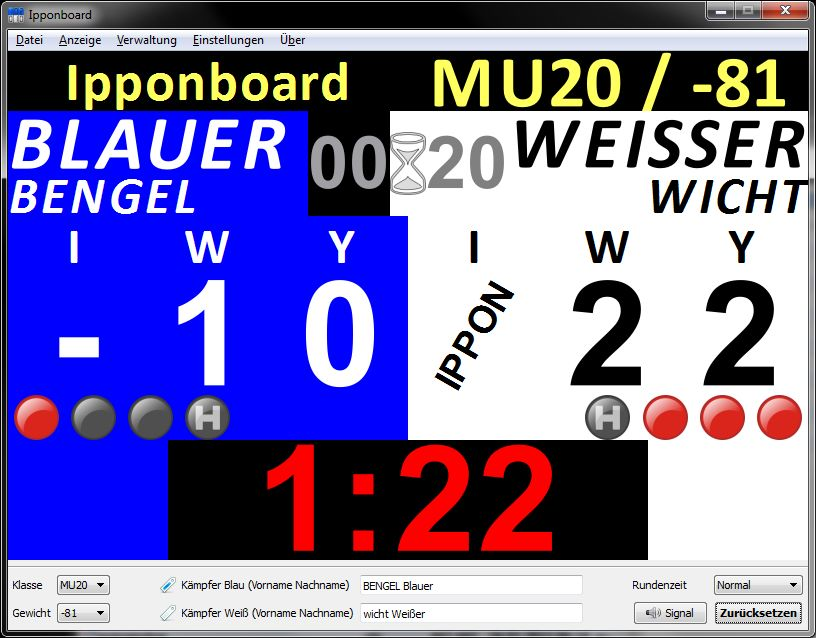

% *Ipponboard* - The Judo Score Board
% **Version 1.6**

# *Ipponboard* - General

## License terms
  
Ipponboard was written and developed by Florian Mücke. 

*Copyright © 2009-today Florian Mücke.*
   
**Ipponboard Binaries**

- *Ipponboard may be used freely on any number of computers and the program may be passed on to third parties in unchanged form free of charge.*
- The binaries of the Ipponboard project are released under the following license: [Attribution-NoDerivs 3.0 Unported](http://creativecommons.org/licenses/by-nd/3.0/)

**Ipponboard source code**

- The Ipponboard source code was released under a BDS-like license in 2020.
- Check the [LICENSE file](https://github.com/fmuecke/Ipponboard/blob/master/LICENSE.txt) in https://github.com/fmuecke/Ipponboard repository.

**Third-party components**

Ipponboard uses the following third-party components, which are licensed under the specified types. All license files are also stored in the `Licenses` folder of the Ipponboard installation path.

- Qt Framework, [www.qtproject.org](http://www.qtproject.org), [LGPL](licenses/Qt/LICENSE.LGPL), [LGPL Exception](licenses/Qt/LGPL_EXCEPTION.txt), [Qt License Agreement](licenses/Qt/.LICENSE-DESKTOP)
- Boost C++ libraries, [www.boost.org](http://www.boost.org), [Boost Software License](licenses/boost/LICENSE_1_0.txt), 
- Microsoft Visual C++ CRT, [Visual Studio 2013 Redistributables License](licenses/MSVC/redist.txt)
- JsonCpp, [github.com](https://github.com/open-source-parsers/jsoncpp), [MIT License](licenses/jasoncpp/LICENSE)
- Sounddateien: Public Domain 2003
- FamFam Flag icons, [www.famfamfam.com](http://www.famfamfam.com/archive/flag-icons-released/), [by Mark James Public Domain](licenses/flags/readme.txt)
- Fugue Icons, [Yusuke Kamiyamane](http://p.yusukekamiyamane.com/), [Creative Commons Attribution 3.0 license](http://creativecommons.org/licenses/by/3.0/), [copyright.txt](licenses/Fugue-iconset/copyright_fugue.txt), [README.txt](licenses/Fugue-iconset/README.txt)
- Tinytoml, [tinytoml](https://github.com/mayah/tinytoml), [BSD 2-clause](licenses/tinytoml/LICENSE)

## Acknowledgement

My special thanks go to the following people who contributed significantly to its creation:

- Heini Schäfer - for the idea, the incentive, the criticism and the know-how
- My wife Anja for her patience
- Christophe Henry - for 'boost::msm
- as well as the following clubs for trust and feedback: 
  *TSV Königsbrunn, Post SV Telekom Augsburg, TSV Peiting, TSV München-Grosshadern, 
 DJK Ingolstadt, PSV München, TSV Mainburg*, and many more.

##  System requirements

To use the competition display the following hardware and software requirements apply:

- Computer with at least Windows 7 with external monitor connection (preferably
 a laptop)
- TV or large computer screen for secondary display
- connection cable computer &rarr; secondary screen
- Optional: 
	- USB gamepad to control the display (e.g.Saitek P380)
	- loudspeaker for the mat signal (but can also be played via audio cable via the TV)

## Version history

Information about the contents (changes, bugfixes) of the latest versions can be found on the following page: [Changes](Changes.html)

## Feedback

> *Your opinion counts!*

I think that the display system is pretty great,
it's certainly not flawless, and in one or two places it's still
or other corner it is not perfect yet. *Please help us to improve it!

- Bring your ideas and suggestions
- Try it out in your club
- Tell your friends
- Inform us about bugs and problems with the service

## Contact

Questions or suggestions for improvement may be directed to:

- Homepage: <https://ipponboard.koe-judo.de> 
- Issues and bug tracker: [https://github.com/fmuecke/Ipponboard/issues](https://github.com/fmuecke/Ipponboard/issues)  
- E-Mail: [ipponboardinfo ât gmail.com](mailto:ipponboardinfo@gmail.com)  

# Operation & Settings

Ipponboard is an advanced display system for managing fight time 
time and points, designed specifically for judo competition. 
judo competition. During the development, special attention has been and will be paid to 
special attention:
  
- excellent readability
- easy handling
- uncomplicated use
 
The program is basically operated from a PC (laptop) and controlled with mouse 
or gamepad. Ipponboard manages two displays, an external one for the 
the fighters/supervisors/audience and one for the timekeepers. The display of the 
timekeeper is mirrored, so that it can be better assigned to the fighters. 
to the fighters.

## Displays

Ipponboard uses two customized displays to provide the best possible comfort for the operators on one side and the fighters/referees and spectators on the other.

Each display consists mainly of five areas: 

- Fight time: this is located at the bottom of the display. If the fight is interrupted the fight time is displayed in red, otherwise in yellow.
- Scores: The scores are grouped on the side of the respective fighter and in the respective color combination (white on blue or black on white).
- Penalties are symbolized by red dots
- Holding time 
- Fight information (mat number, current weight class)
- Names of the fighters

### Primary display

The primary display serves as the central control unit for the 
Ipponboard operator. On it all information is available and 
adjustable:

- Start/stop/(reset) fight and hold time
- Reset fight
- change names of fighters
- Set/reset scores
- change fight information (mat number, current weight class)

### Secondary/external display

In contrast to the primary display, the secondary display shows only those details that are 
details that are essential for the fight:

- only the scores up to Waza-ari (Ippon is superimposed flashing)
- only the active penalties
- only the active hold time

In addition, the secondary display does not respond to mouse input.

> Tip:* The secondary display can be (de)activated via the hotkey `F2`.

Whether the second display should be shown immediately at program start or on which screen 
or on which screen it should be displayed, can be defined in the program settings.

How to configure the computer for dual view operation can be found in the appendix [Preparing the computer for dual screen operation](#Appendix_DualView).

## Program settings

The program settings can be found in the application menu under *Settings*. 
They provide access to various general options for customizing the program:

- Configure secondary display
- Change colors and font for info area
- Change colors for fighters/ratings
- Select sound file for timekeeper table signal

Besides the general options, the gamepad buttons can also be reassigned in the settings menu.

# Control

Ipponboard can be controlled with the following input devices:

- mouse
- keyboard
- gamepad

Even if the control by mouse is very intuitive and catchy, my experiences have shown that with the Gamepad a substantially 
more relaxed operation is possible. Therefore I would like to recommend the control with the gamepad to you with the following reasons:

**Advantages of the Gampad control**. 
 
1. *Everything under control*

    With a standard USB gamepad, all essential functions can be accessed at the touch of a button - whether it's the hold display, fight time, scores or penalties. The left hand is responsible for the left fighter and the right hand for the right.

2. *Full concentration on the fight*. 

   The eye does not have to constantly switch back and forth between the scoreboard and the mat. Scores can be entered directly and there is no need to constantly search for the mouse pointer and awkwardly move it to the score symbol. A press of a button and an occasional cursory check is all that is needed.

3. *Lean back and relax*.

   The best thing about it: you can lean back on your chair instead of sitting concentrated and tense in front of the mouse.

4. *Coolness factor*

   For youth use, don't underestimate the "coolness factor" - everyone really wants to operate like this!

	
## Operating principle of the control system

### Mouse control

The program can be controlled completely with the mouse. All that is required is to click on the respective fields in the primary (embedded) display 
or on the corresponding buttons in the user interface. 

#### Assigning and undoing points

In order to assign points or take them back, you only have to click in the respective field. The following applies:

Mouse Button | Action
----- | ------
left | give score
right | cancel score

#### Start/stop time (*Hajime/Matte*)

The fight time can be started (yellow) and stopped (red) with a left click. 

#### Start/stop hold time (*Osaekomi / Toketa*)

To start the hold time, click on the "00" field next to the hourglass. The hold will be displayed automatically for blue at first. 
Using the context menu of this field (right click), the hold can then be assigned to white, if necessary.

Clicking the field again with the left mouse button stops the hold time.

The time is now displayed until either a grab is triggered again, or the main time runs again after stopping (=Hajime).

### Gamepad control

#### Konfigure buttons

#### Awarding and undoing points
Points are awarded using the two analog sticks. For the blue fighter, the following directions correspond to the respective points:

 Score | Button 
---------------- | ----- 
 + Ippon | up 
 - Ippon | down 
 + Waza-ari | top right
 - Waza-ari | down left
 + Yuko | right                                
 - Yuko | left                        
 + Shido | left up
 - Shido | right bottom
 +/- Hansokumake | press stick

For the white fighter the directions are simply mirrored.

> *Caution:* Please pay attention to how the respective axes of the gamepad are configured. You may have to invert them in the settings.
> 
> *Tip:* To find out how the respective gampad is aligned, you can use the included program 'GamepadDemo.exe'. There you can see how the respective axes are aligned and how the buttons are numbered internally.

#### Start/stop time (*Hajime/Matte*)

The main time is started or stopped using the 'down' button of the gamepad's turnstile.

#### Start/stop hold time (Osaekomi/Toketa)

The hold time is set in the default setting by pressing the rear upper fire button (`button 7` and `button 8`). Thereby the 
left one is for the blue fighter and the right one for the white fighter. Pressing the hold key again will stop the hold (*Toketa*). 

If the button of the other fighter is pressed, it can be switched and the hold will then apply to that fighter.

#### Reset hold time

The first version could reset the time automatically on hajime or renewed *Osaekomi*. Since this does not necessarily correspond to the usual 
behavior of a display, the behavior has been changed so that the hold time can and must be reset manually. 
must. This is done with the rear lower fire keys.

#### Reset complete display

To reset all values, the buttons defined for this purpose must be pressed simultaneously.

## Special features

### *Sono-mama/Yoshi*

For *Sono-mama* you have to press mat during a hold. The hold time is then marked in gray (paused). By pressing the respective hold button, the hold can be resumed (*Yoshi*).

# Appendix

## Troubleshooting

### Preparing the computer for dual screen operation {#Anhang_DualView}

When configuring the second screen on the computer, the following points must be points must be strictly followed:

- *Expand desktop*

    So that the second screen can be used in the program, it must be it must be configured as an extended desktop. The resolution resolution is not important, it will be detected by the program and the content is scaled accordingly. If the display on the second monitor is not correct, it can also be set manually in the program settings manually. This requires a restart of the program.

- *Turn off interference*
   
   Please make sure that the computer does not automatically go to sleep (standby) automatically goes to sleep (standby) or the screen saver turns on. screen saver turns on. This can be avoided with newer newer computer models by switching them to presentation mode. presentation mode.
